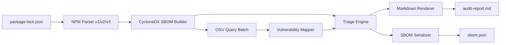

# Audit-Ready SBOM Kit — Architecture of Record
> This document is the single source of truth for all technical decisions. All changes must be reviewed against this spec.
> Last updated: 2026-05-05

## Product Philosophy

**audit-ready is not just a vulnerability scanner.** It is an **audit trail platform** that links two artifacts — a CycloneDX SBOM and machine-readable `reasonCode` verdicts — to prove to auditors that the organization's security operations are controlled and version-tracked like code.

The core premise: every vulnerability finding exists in the context of a decision. Who decided it was acceptable? What was the justification? When does the exception expire? Without a tool that captures that decision chain, audits devolve into retrospective guesswork. With audit-ready, they become a matter of presenting a git history and a JSON file.

Key commitments:

- **Deterministic** — If the input is the same, it always produces exactly the same output. Bit for bit, every time.
- **Immutable** — All data models are `readonly`. Configuration changes are recorded as Git history, not applied in-place.
- **Audit-first** — The tool persists not just scan results, but the decision process: reason, approver, and deadline for every exception. Auditors receive a log, not a snapshot.

---

## Architecture Overview

### System Diagram


### Directory Structure
```
src/
├── cli/
│ └── commands/
│ ├── scan.ts
│ ├── init.ts
│ ├── validate-config.ts
│ ├── audit-self.ts
│ └── audit-exceptions.ts
├── core/
│ ├── sbom/
│ │ ├── cyclonedx/
│ │ │ ├── model.ts          ← immutable data contracts
│ │ │ ├── builder.ts
│ │ │ ├── serializer.ts
│ │ │ └── validator.ts
│ │ └── index.ts
│ ├── triage/
│ │ ├── engine.ts            ← applyTriage, matchesFailPolicy
│ │ ├── reachability.ts
│ │ └── rules/
│ │     ├── default-rules.ts ← Object.freeze()d rule list
│ │     └── types.ts
│ ├── policy/
│ │ ├── exceptions.ts        ← applyExceptions
│ │ └── types.ts
│ └── utils/
│     └── purl.ts            ← RFC-compliant, no stdlib encoders
├── adapters/
│ ├── npm/
│ │ ├── parser.ts, normalizer.ts, resolver.ts
│ │ ├── lockfile-v1.ts, lockfile-v2.ts, lockfile-v3.ts
│ │ └── types.ts
│ ├── vuln-db/
│ │ ├── osv-client.ts       ← only endpoint: api.osv.dev
│ │ ├── osv-to-cyclonedx.ts
│ │ └── cache.ts
│ └── output/
│     ├── sarif.ts
│     └── markdown/renderer.ts
├── config/
│ └── loader.ts

.audit-history/              ← Phase 3: Git-committed scan snapshots
.audit-policy.json           ← Team approval rules and exception list
schemas/
├── cyclonedx-1.5.schema.json
├── sarif-schema-2.1.0.json
└── audit-policy.schema.json
```

---

## Principles of Deterministic Architecture

### 1. Deterministic
Same `package-lock.json` and same tool version always produce identical output. This is enforced mechanically — not by convention:

- A test in `test/unit/policy.test.ts` (lines 97–113) statically scans the source of every core function for banned tokens: `Date`, `Date.now()`, `Math.random()`, `process.env`. The build fails if any are found.
- Every function in `src/core/` is a pure function: no I/O, no mutation, no global state.
- `DEFAULT_RULES` is `Object.freeze()`d — the rule priority order cannot change at runtime.

### 2. Immutable
- All fields in `src/core/sbom/cyclonedx/model.ts` are `readonly`.
- Every output object is `Object.freeze()`d at the boundary.
- SBOM schema validation runs *before* a file is written. If validation fails, no file is written and the tool exits with code `1`.

### 3. Audit-Ready
The audit value is not the scan result — it is the **decision trail**. Every `reasonCode` is paired with:
- The rule that assigned it (traceable to `default-rules.ts`)
- An optional exception: `reason` (min 20 chars), `expires_at`, `approved_by`
- Provenance metadata in every SBOM: `ar:commit`, `ar:nodeVersion`, `ar:toolVersion`

The `.audit-policy.json` is Git-controlled. Decisions live in version history, not in a running database.

---

## reasonCode System

`reasonCode` is the primary auditable artifact. Every dependency in the output SBOM carries exactly one.

```typescript
export enum ReasonCode {
  DEV_DEPENDENCY_ONLY    = 'DEV_DEPENDENCY_ONLY',    // scope === 'excluded'
  OPTIONAL_DEPENDENCY    = 'OPTIONAL_DEPENDENCY',    // scope === 'optional'
  TRANSITIVE_NO_EXPLOIT  = 'TRANSITIVE_NO_EXPLOIT',  // vulns > 0, required, !isDirect
  DIRECT_UNPATCHED       = 'DIRECT_UNPATCHED',       // vulns > 0, required, isDirect
  NO_KNOWN_VULNERABILITY = 'NO_KNOWN_VULNERABILITY', // no vulns found
  EXEMPTED               = 'EXEMPTED'               // valid, non-expired exception
}
```

### Extended reasonCodes (Phase 3)

| Code | Trigger |
|------|---------|
| `EOL_DEPENDENCY` | Detects end-of-life runtimes and frameworks via npm registry metadata |
| `DEPRECATED_PACKAGE` | Detects deprecated packages via npm registry `deprecated` field |

These are assessed alongside vulnerability triage — they do not replace `reasonCode` but annotate it with a `arTriage.healthTier`.

### Why `reasonCode` over a score
A CVSS numeric score changes when the CVE is re-scored — the same lockfile produces different output across time. A `reasonCode` is a fact about the dependency at scan time: it is `DIRECT_UNPATCHED` because it is a direct dependency with no known patch. That fact is stable. The output is reproducible by any party with the same inputs.

---

## Design Decisions (LOCKED)

- **Vulnerabilities**: Inline on `Component.vulnerabilities[]`. Not VEX-only.
- **metadata.component**: Sourced from `package.json` (name, version, description, author).
- **Evidence**: `{ occurrences: readonly FilePath[] }` only. No source snippets or callstacks.
- **Cache key**: `${ecosystem}:${name}@${version}`. No integrity hash.
- **License conflicts**: Extraction only. No resolution logic.
- **Offline mode**: Exit code `2` on OSV unavailability.
- **Monorepo**: Single lockfile per invocation (Phase 3 targets multi-lockfile orchestration).
- **reasonCode Primacy**: Every Component output MUST carry a `reasonCode` field as the primary auditable justification. Human-readable `arTriage.rationale` is supplemental.
- **Deterministic-Only**: ALL classification logic in Phase 1 MUST be deterministic rule-based. Zero tolerance for probabilistic scoring or ML inference. See [docs/determinism.md](determinism.md).
- **Immutable Data**: ALL data model fields and arrays in `src/core/sbom/cyclonedx/model.ts` MUST be declared `readonly`.
- **Schema-First**: ALL CycloneDX 1.5 JSON output MUST validate against `schemas/cyclonedx-1.5.schema.json` before write.
- **PURL Sovereignty**: `buildPurl()` in `src/core/utils/purl.ts` is the sole PURL source. Standard library encoders (`encodeURIComponent`, `URL`) are forbidden in that file.

---

## Critical Systems

### CycloneDX 1.5 Compliance
- Schema: bundled at `schemas/cyclonedx-1.5.schema.json`. No network fetch.
- Validation: AJV compiled once at startup, runs before every write.
- `bom-ref`: derived from PURL via `buildPurl()`.

### OSV Integration
- **Only endpoint contacted:** `https://api.osv.dev/v1/querybatch`
- **Data transmitted:** PURLs only. No source code, repository URLs, secrets, or environment variables.
- **Network failure:** exit code `2`, SBOM and report still written with `NO_KNOWN_VULNERABILITY` as conservative default.
- Batched: up to 1000 PURLs per request, 30s timeout.

### PURL Construction (`src/core/utils/purl.ts`)
- Scoped packages: `pkg:npm/%40scope%2Fname@version`
- `%2F` encoding on namespace separator is mandatory per PURL spec §3.3
- No `encodeURIComponent`, no `URL` constructor
- Exhaustive unit test coverage in `test/unit/purl.test.ts`

### Caching Layer (Phase 3 enhancement)
- Type: JSON file at `~/.audit-ready/osv-cache.json` + in-memory LRU (max 500 entries)
- TTL: 24 hours
- Key: `pkg:npm/name@version`
- `--force-refresh` bypasses cache

---

## Phase 3: Cache, Health Check & Automated Audit Trail

### Phase 3.1: Integrated Cache Platform

Two-tier cache design to balance performance and audit reliability:

```
Cache Tier 1: In-memory LRU (max 500 entries, session-scoped)
     ↓ miss
Cache Tier 2: ~/.audit-ready/osv-cache.json (24h TTL, persistent)
     ↓ miss
         OSV.dev (only external endpoint)
```

**Audit constraint:** Cache entries are PURL-to-vulnerability-set only. No source code, no lockfile contents. The cache is a performance optimisation, not a data store. Entries expire after 24h to prevent stale vulnerability data from masking new CVEs.

### Phase 3.2: Automated Audit Trail Management (Git Flow)

`audit-ready` supports committing scan results to the repository as a living audit log. This is the feature auditors most consistently request: a chronological record of "what changed, when, and why."

**Recommended CI integration:**
```bash
npx audit-ready scan --save --commit
```

**What `--save` does:**
- Writes scan output to `.audit-history/${date}.json` (SBOM + decision log)
- Produces a signed/identified commit in the repository

**Recommended directory structure:**
```
.audit-policy.json      # Team approval rules and exception list (Git-controlled)
.audit-history/         # Evidence — auditors review this directory
├── 2026-05-01.json      # Snapshot: SBOM + reasonCode log for the audited period
├── 2026-05-15.json
└── ...
```

**Chronological explanation function:**
Auditors can trace the commit log to retrieve any past scan:
```bash
git log --oneline .audit-history/
git show <commit>:$(date +%Y-%m-%d).json  # Reconstruct any past snapshot
```

The SBOM provenance properties (`ar:commit`, `ar:nodeVersion`, `ar:toolVersion`) link the artifact to the exact commit. Downloading the artifact and reading `properties[]` provides the second link. Tampering with either requires changing the Git history.

**`scripts/generate-provenance.ts`** embeds build-time metadata (git commit, Node version, tool version) into `sbom.json` properties. Add to CI as a build step:
```json
{
  "scripts": {
    "generate-provenance": "npx ts-node scripts/generate-provenance.ts"
  }
}
```

### Phase 3.3: Enhanced Health Assessment (reasonCode Health Tier)

In addition to vulnerability classification, Phase 3 introduces `arTriage.healthTier` — an annotation layer that assesses the operational lifetime of a dependency:

| healthTier | Trigger |
|-----------|---------|
| `EOL` | Runtime or framework has reached end-of-life (detected via npm registry metadata) |
| `DEPRECATED` | Package has `deprecated` field set in npm registry |
| `ACTIVE` | Neither of the above |

This does not change the `reasonCode`. A deprecated package with no known vulnerabilities is still `NO_KNOWN_VULNERABILITY` with `arTriage.healthTier: DEPRECATED`. The health tier surfaces a separate risk dimension that vulnerability scanning alone misses: dependencies that are not yet vulnerable but will become maintenance liabilities.

---

## Audit-Specific Operational Protocol

The following templates allow design partners to be audit-ready from day one of implementation.

### Auditor Response Flow (Q&A Template)

When auditors raise concerns, the team should be able to respond immediately:

**"Why was this vulnerability left unaddressed?"**
→ Provide `reasonCode` and the matching rule from `default-rules.ts`. Explain whether the package is `DEV_DEPENDENCY_ONLY`, `TRANSITIVE_NO_EXPLOIT`, or otherwise out of the production path.

**"Who made the security exception decision?"**
→ Show `approved_by` from the relevant entry in `.audit-policy.json`. This field records the team, individual, or ticket reference that signed off.

**"Has the exception expired? Is it still valid?"**
→ Run `audit-ready audit-exceptions` to check all `expires_at` values. Provide the date and explain the current mitigation plan or renewal status.

**"Can you reproduce this result?"**
→ Run `audit-ready audit-self` to generate the tool's own SBOM using the production pipeline. Verify `ar:commit` in `properties[]` matches the commit being audited.

### Recommended Onboarding Checklist for Design Partners

- [ ] `audit-ready scan` runs in CI on every merge to `main`
- [ ] `.audit-policy.json` is committed to the repository and reviewed in PRs
- [ ] `audit-ready audit-exceptions` runs before every release; expired entries block the build
- [ ] `audit-ready audit-self` runs in CI to verify tool integrity
- [ ] `.audit-history/` directory is committed and included in artifact uploads
- [ ] All exception `reason` fields are specific technical justifications (minimum 20 characters)
- [ ] All exception `approved_by` fields are non-empty (team name, individual name, or ticket reference)
- [ ] `ar:commit`, `ar:nodeVersion`, `ar:toolVersion` are present in every SBOM `properties[]`
- [ ] SARIF output is uploaded to GitHub Advanced Security on every scan

---

## Phase 1–2 Implementation Status

### Phase 1 — Complete
| Task | Status | Date |
|------|--------|------|
| Foundation (normalized PackageNode, v1/v2/v3) | ✅ | 2026-05-01 |
| Logic (rule-based triage, reasonCode) | ✅ | 2026-05-01 |
| Compliance (CycloneDX 1.5 + VEX, AJV schema validation) | ✅ | 2026-05-02 |
| Transparency (audit-ready audit-self, provenance script) | ✅ | 2026-05-02 |

### Phase 2 — Complete
| Item | Status | Date |
|------|--------|------|
| P0: `--fail-on` and `--dry-run` (`matchesFailPolicy`, static banned-token test) | ✅ | 2026-05-02 |
| P1: SARIF 2.1.0 output (GitHub Advanced Security integration) | ✅ | 2026-05-02 |
| P2: Exception management (`applyExceptions`, `audit-exceptions`) | ✅ | 2026-05-04 |
| P3: `.audit-policy.json` externalized config (`loadConfig`, `--init`, `validate-config`) | ✅ | 2026-05-04 |

### Phase 3 — In Progress
| Feature | Status |
|---------|--------|
| OSV cache (two-tier, 24h TTL) | 🚧 |
| `--force-refresh` flag | 🚧 |
| `--save --commit` git history integration | 🚧 |
| Phase 3.3 Health Assessment (`EOL_DEPENDENCY`, `DEPRECATED_PACKAGE`, `healthTier`) | 🚧 |

### Phase 4–5 — Pending
- Multi-lockfile / monorepo support
- `--force` flag for emergency exception override (Phase 5)
- Structured errors with file/line specificity

---

## Strategic Pivot (Non-Negotiable)

Three principles that override any prior design decision:

1. **No LLM inference** — all classification is deterministic rule-based logic. Every verdict must be reproducible from the same inputs with no variance.
2. **Full transparency** — the tool never sends user code or secrets anywhere. Only PURLs go to OSV. See [docs/transparency.md](transparency.md).
3. **Rationale-first, not detection-first** — the core value is mapping detected vulnerabilities to defensible, auditable justifications. Every output node carries a `reasonCode`.

## New Architectural Principles
- **`src/core` Isolation**: Zero external dependencies. Node.js built-ins also banned — pure functions only.
- **Schema First**: CycloneDX 1.5 JSON is the canonical output. All output passes schema validation before write.
- **Immutability**: All data model fields and arrays are `readonly`. No exceptions.
- **No-Magic**: Every classification decision carries a `reasonCode`. No black-box scoring.

---

## Model.ts Specification (Data Contract)
- CycloneDX 1.5 inspired. Fields match spec names where applicable.
- All arrays: `readonly`.
- All objects: immutable.
- Zero external dependencies in `src/core/`.
- TypeScript strict mode enabled.
- File: `src/core/sbom/cyclonedx/model.ts`
- Implements: `Bom`, `Component`, `Vulnerability`, `Rating`, `Affects`, `ExternalReference`, `Evidence`.

This document defines the contract between the implementation and the audit. It does not describe intent. It states outcome. Changes require PR and approval from two senior engineers.

---

## Critical Risks (Pre-Launch Checklist)

| Risk | Mitigation |
|------|------------|
| CR-1: CycloneDX schema drift | Validate against `cyclonedx-cli validate` and `syft convert` |
| CR-2: PURL encoding errors | Unit test all scoped, prerelease, build metadata patterns against purl-spec |
| CR-3: OSV API downtime | Cache + retry (3 attempts, 1s/4s/16s) + graceful degradation (exit code 2) |
| CR-4: Reachability false negatives | Label all scores "HEURISTIC" in report. Never downgrade Critical severity. |
| CR-5: License field unreliability | Normalize to SPDX. Emit warning for unknown licenses. `--strict-licenses` flag to error. |
| CR-6: Audit trail completeness | Include `metadata.timestamp`, `metadata.tools`, lockfile SHA-256, and OSV query metadata in all outputs |
| CR-7: npm lockfile format drift (v10+) | `parser.ts` throws explicit error for unknown `lockfileVersion`. Adapters are version-specific and swappable. |
| CR-8: Stale exceptions silently suppressing real findings | `audit-exceptions` exits code 1 on any expired entry; no silent fallback |
| CR-9: SBOM integrity tampering | Provenance metadata (`ar:commit`, `ar:nodeVersion`, `ar:toolVersion`) embedded in artifacts; Git history link validated by auditor |

---

## CI/CD Integration Patterns

### Pattern 1: Scan → Fail-on (Exit Code Gate)
```
Pipeline Start
     │
     ▼
npx audit-ready scan --dry-run
     │
     ├── exit 0 → Continue (no policy violations)
     │
     └── exit 1 → Stop pipeline; CI fails build
```

### Pattern 2: Scan → SARIF Upload (GitHub Advanced Security)
```
npx audit-ready scan --output-sarif results.sarif --fail-on DIRECT_UNPATCHED
     │
     ▼
actions/upload-sarif@v3
     │
     ▼
GitHub Security tab: findings grouped by ruleId (= reasonCode)
```

### Pattern 3: Scan → Audit History Commit (Phase 3)
```
npx audit-ready scan --save --commit
     │
     ▼
.audit-history/${date}.json written and committed
     │
     ▼
Artifact uploaded with provenance properties
```

---

## Configuration Precedence

| Source | Location |
|--------|---------|
| CLI flags | `--fail-on`, `--policy`, `--output-dir`, `--output-sarif` |
| Policy file | `.audit-policy.json` (via `--policy <path>`) |

**Merge rules:**
- `failOn`: **CLI wins** — file value is discarded for the session
- `exceptions`: **Merged (additive union)** — file exceptions are never shadowed by CLI flags

---

## Exception Management Principles

### Schema Contract
Every exception entry in `.audit-policy.json` must contain all three fields. The tool refuses to run if any field is missing or invalid — no silent degradation, no partial application.

| Field | Constraint |
|-------|-----------|
| `reason` | Minimum 20 characters. Specific technical justification. No placeholders. |
| `expires_at` | ISO 8601. `loadConfig` throws `ExpiredExceptionError` with exit code 1 if in the past. |
| `approved_by` | Non-empty string: team name, individual name, or ticket reference. |

### Expired Exceptions
There is no silent fallback. Before every scan, `audit-exceptions` or `loadConfig` checks all `expires_at` values. An expired entry blocks the build with a clear error message naming the exception ID. The operator must renew or remove the entry. `--force` (Phase 5) will provide an emergency override that downgrades to a warning.

### Rationale
Auditable exceptions must carry enough specificity for a reviewer to understand the trade-off without re-running the analysis. Generic reasons ("ok", "ignored", "N/A") provide no value in a compliance audit. The 20-character floor enforces deliberate authoring.