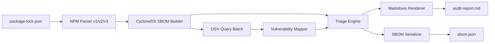

# Audit-Ready SBOM Kit — Architecture of Record
> This document is the single source of truth for all technical decisions. All changes must be reviewed against this spec.
> Last updated: 2026-05-03

## Core Mission
A local-first CLI tool (`npx audit-ready scan`) that generates CycloneDX 1.5 SBOM and audit-ready risk triage reports from package-lock.json. Key innovation: reachability-based "Excuse Generator" for justifying vulnerability waivers.

## Architecture Overview

### System Diagram


### Core Principles
- **Adapter Pattern**: Decouple parser → vuln-db → output.
- **CycloneDX as Canonical**: JSON is the artifact. Markdown is for humans.
- **Opinionated Defaults**: No config by default — override only via .auditrc.json.
- **Local First**: Only OSV lookups hit the network. All else offline.
- **No External Dependencies**: Pure TypeScript, no graph libraries.

### Directory Structure (Immutable)
```
src/
├── cli/
│ └── commands/
│ └── scan.ts
├── core/
│ ├── sbom/
│ │ ├── cyclonedx/
│ │ │ ├── model.ts
│ │ │ ├── builder.ts
│ │ │ ├── serializer.ts
│ │ │ ├── validator.ts
│ │ │ └── types.ts
│ │ └── index.ts
│ ├── triage/
│ │ ├── engine.ts
│ │ ├── reachability.ts
│ │ ├── rules/
│ │ │ ├── default-rules.ts
│ │ │ └── types.ts
│ │ └── index.ts
│ └── graph/
│ ├── dependency-graph.ts
│ └── types.ts
├── adapters/
│ ├── npm/
│ │ ├── parser.ts
│ │ ├── lockfile-v1.ts
│ │ ├── lockfile-v2.ts
│ │ ├── lockfile-v3.ts
│ │ ├── purl.ts
│ │ ├── license-extractor.ts
│ │ ├── resolver.ts
│ │ └── types.ts
│ ├── vuln-db/
│ │ ├── osv-client.ts
│ │ ├── osv-to-cyclonedx.ts
│ │ ├── cache.ts
│ │ └── types.ts
│ └── output/
│ └── markdown/
│ ├── renderer.ts
│ ├── sections/
│ │ ├── metadata.ts
│ │ ├── risk-summary.ts
│ │ ├── findings.ts
│ │ ├── excuses.ts
│ │ ├── top-fixes.ts
│ │ └── limitations.ts
│ └── index.ts
├── config/
│ ├── loader.ts
│ ├── defaults.ts
│ └── types.ts
├── utils/
│ ├── logger.ts
│ ├── fs.ts
│ └── errors.ts
└── types/
└── global.ts

schemas/
├── cyclonedx-1.5.schema.json
└── sarif-schema-2.1.0.json

test/
├── unit/
│   ├── sarif.test.ts        ← P1
│   └── policy.test.ts       ← P0
├── integration/
│   ├── e2e-scan.test.ts
│   ├── pipeline.test.ts
│   ├── fail-on.test.ts      ← P0
│   └── sarif-output.test.ts ← P1
├── contracts/
│ └── osv-api.test.ts
├── fixtures/
│ ├── lockfiles/
│ │ ├── npm-v1/
│ │ ├── npm-v2/
│ │ └── npm-v3/
│ └── osv-responses/
│ ├── single-vuln.json
│ ├── multi-vuln.json
│ ├── no-vulns.json
│ └── paginated.json
└── snapshots/
├── expected-sbom-npm-v1.json
├── expected-sbom-npm-v2.json
├── expected-sbom-npm-v3.json
└── expected-report.md
```

## Design Decisions (LOCKED)
- **Vulnerabilities**: Inline on Component.vulnerabilities[]. Not VEX.
- **metadata.component**: Sourced from package.json (name, version, description, author).
- **Evidence**: { occurrences: readonly FilePath[] } only. No snippets or callstacks.
- **Cache key**: ${ecosystem}:${name}@${version}. No integrity hash.
- **License conflicts**: Extraction only. No resolution logic.
- **Offline mode**: Exit code 2 on OSV unavailability.
- **Monorepo**: Single lockfile per invocation.
- **reasonCode Primacy**: Every Component output MUST carry a reasonCode field as the primary auditable justification. Human-readable rationale is supplemental.
- **Deterministic-Only**: ALL classification logic in Phase 1 MUST be deterministic rule-based. Zero tolerance for probabilistic scoring or ML inference. _See [docs/determinism.md](determinism.md) for the full explanation of the rule engine, reasonCode priority table, and the static source-scan test._
- **Immutable Data**: ALL data model fields and arrays in `src/core/sbom/cyclonedx/model.ts` MUST be declared `readonly`.
- **Schema-First**: ALL CycloneDX 1.5 JSON output MUST validate against `schemas/cyclonedx-1.5.schema.json` before write.

## Critical Systems

### CycloneDX 1.5 Compliance
- Schema: Bundled schemas/cyclonedx-1.5.schema.json. No network fetch.
- Validation: ajv compiled once at startup. Validate before write.
- bom-ref: Generated via PURL.

### PURL
- **DEPRECATED:** `src/adapters/npm/purl.ts` removed — canonical PURL source is `src/core/utils/purl.ts`
- Generation MUST use custom function in `src/core/utils/purl.ts` (standard library encoders forbidden)
- Full RFC-compliant encoding following PURL spec §3.3 exactly
- Scoped packages: pkg:npm/%40scope%2Fname@version

### License
- Extracted from npm license field.
- Normalized to SPDX expressions or named licenses.

### Caching Layer
- Type: JSON file at ~/.audit-ready/osv-cache.json + in-memory LRU (max 500 entries).
- TTL: 24 hours.
- Key: pkg:npm/name@version.
- Flag: --force-refresh bypasses cache.

### Triage Engine
- Rule evaluation: First-match wins. Priority-order list.
- reasonCode: Machine-readable audit justification (primary output)
- Reachability score (supplemental):
  - direct = 1.0
  - transitive = 0.5
  - dev = 0.2
  - optional = 0.1
- Never downgrade Critical severity below "Needs Review".
- Rationale template: "Vulnerability ${id} is ${depType} and has reachability weight ${weight}."

## Strategic Pivot (Non-Negotiable)
Three principles that override any prior design decision:

1. **No LLM inference in Phase 1** — all classification is deterministic rule-based logic. Every verdict must be reproducible from the same inputs with no variance.
2. **Full transparency** — the tool never sends user code or secrets anywhere. Only PURLs go to OSV. This must be documented in the CLI output itself (`--explain-network` flag, Phase 2).
3. **Rationale-first, not detection-first** — the core value is mapping detected vulnerabilities to defensible, auditable justifications. Every output node carries a `reasonCode`.

## New Architectural Principles
- **src/core Isolation**: Zero external dependencies. Node.js built-ins also banned — pure functions only.
- **Schema First**: CycloneDX 1.5 JSON is the canonical output. All output passes schema validation before write.
- **Immutability**: All data model fields and arrays are readonly. No exceptions.
- **No-Magic**: Every classification decision carries a reasonCode. No black-box scoring.

## MVP Roadmap

### Phase 0: End-to-end pipeline (DEPRECATED)
**Note**: This phase is superseded by the strategic pivot. The lockfile-v2 parser is replaced by the v1/v2/v3 normalizer in Phase 1, Task 1.
**Deliverables:** Parse package-lock.json, generate sbom.json and basic audit-report.md
**Acceptance:**
- npx audit-ready scan creates sbom.json and audit-report.md
- Completes in <5s on 10-dep project
- Exits code 0 on success, 1 on parse failure

### Phase 1: Foundation, Logic, Compliance & Transparency (Reworked)
**Deliverables:** Normalized PackageNode from all lockfile versions, rule-based triage with reasonCode, CycloneDX 1.5 + VEX output, self-audit capability
**Acceptance:**
- All three lockfile versions (v1/v2/v3) produce identical graph shape
- Zero non-deterministic output from triage engine
- Output passes ajv validation against schemas/cyclonedx-1.5.schema.json
- Tool can generate self-SBOM and verify its own integrity

Phase 1 Execution Plan (sequence is fixed — each task gates the next):

| # | Name | Deliverable | Gate |
|---|------|-------------|------|
| 1 | Foundation | Normalized `PackageNode` from npm v1/v2/v3 lockfiles | All 3 versions produce identical graph shape |
| 2 | Logic | Rule-based triage engine with `reasonCode` per verdict | Zero non-deterministic output |
| 3 | Compliance | CycloneDX 1.5 JSON + VEX document output | Passes CycloneDX schema validation |
| 4 | Transparency | Self-SBOM generation + provenance in CI/CD workflow | Tool can audit itself |

**Task 1 Gate:** No `PackageNode` generation logic is written until `test/unit/purl.test.ts` passes fully.

---

### PURL Generation — `src/core/utils/purl.ts`

`PackageNode.purl` must be generated by a custom function in `src/core/utils/purl.ts`.
Standard library URL encoders (`encodeURIComponent`, `URL`, etc.) are forbidden for this function.

**Reason:** Encoding inconsistencies (`@` → `%40`, `/` → `%2F`, etc.) between libraries and between npm lockfile versions produce divergent PURL strings for the same package. In an audit context, a PURL mismatch between the SBOM and the VEX document is a fatal evidence inconsistency — it invalidates the audit trail.

**Required behavior:**
- Namespace separator `/` in scoped packages (`@scope/name`) must be encoded as `%2F` in the PURL name segment
- `@` in `pkg:npm/%40scope%2Fname@version` must follow the [PURL spec §3.3](https://github.com/package-url/purl-spec) exactly
- Version string is appended unencoded after the final `@`
- Function signature: `buildPurl(name: string, version: string): string`
- Must include an exhaustive unit test suite in `test/unit/purl.test.ts` covering: scoped packages, unscoped packages, versions with pre-release labels, names with hyphens and dots

**Review priority:** This function is the highest-review-priority item in Phase 1. No other Task 1 code is merged until `purl.ts` passes review.

### Phase 2: Triage engine and reachability (Updated for reasonCode)
**Deliverables:** engine.ts, reachability.ts, default-rules.ts, excuses.ts, top-fixes.ts (updated to use reasonCode)
**Acceptance:**
- Every vulnerability has reasonCode (primary), reachabilityScore, rationale, adjustedSeverity
- "Excuses" section lists waived items with reasonCode and rationale
- "Top 5 Fixes" ordered: direct+critical > direct+high > transitive+critical > transitive+high
- Critical vulns on transitive deps never downgraded below "Needs Review"

#### Phase 2 Implementation (P0 + P1) — Complete

**P0 — `--fail-on` and `--dry-run`** *(complete: 2026-05-02)*
- `matchesFailPolicy()` — `src/core/triage/engine.ts`; zero Date/Math.random/process.env references
- `parseScanOptions()` — `src/cli/parser.ts`; validates `--fail-on` codes at parse time; exits code 1 before scan on invalid value
- `checkPolicyViolations()` — `src/cli/commands/scan.ts`; logs violations, exits code 1 on non-dry-run violations
- `--dry-run` skips all network calls and file writes; still runs triage and policy checks
- `test/unit/policy.test.ts` — 8 tests (match, no-match, empty codes, multi-code, determinism, banned-token source scan)
- `test/integration/fail-on.test.ts` — 8 tests (parse-time exit 1, valid codes, multi-code, equals syntax, dryRun defaults)

**P1 — SARIF 2.1.0 output** *(complete: 2026-05-02)*
- `buildSarif(components)` pure adapter — `src/adapters/output/sarif.ts`
- `schemas/sarif-schema-2.1.0.json` — minimal conforming schema; `$schema` field omitted to avoid AJV v8 meta-schema loading error
- `--output-sarif <path>` flag — `src/cli/parser.ts` and `src/cli/index.ts`
- `writeSarifReport()` — `src/cli/commands/scan.ts`; structural validation only (no ajv at runtime; failure warns and continues)
- ReasonCode → SARIF level: `DIRECT_UNPATCHED → "error"`, `TRANSITIVE_NO_EXPLOIT → "warning"`, `DEV_DEPENDENCY_ONLY/OPTIONAL_DEPENDENCY → "note"`, `NO_KNOWN_VULNERABILITY → omitted`
- `locations[].physicalLocation.artifactLocation.uri` = node purl; `uriBaseId = "ROOT"`; ruleId = reasonCode
- `test/unit/sarif.test.ts` — 13 tests (per-code mapping, NO_KNOWN_VULNERABILITY omission, tool metadata, deduplicated rules, determinism, ajv schema validation)
- ajv NOT in runtime CLI; test files use `createRequire()` pattern for ESM/CJS interop
- `test/integration/sarif-output.test.ts` — CLI `--output-sarif` end-to-end verification

#### Phase 2 Pending (P2 + P3)
- **P2** expiry-based exception management — gated on user signal
- **P3** `.audit-policy.json` externalized config — gated on user signal

#### Directory Structure Additions (Phase 2)
```
src/adapters/output/
├── sarif.ts        ← P1
└── markdown/

schemas/
├── cyclonedx-1.5.schema.json
└── sarif-schema-2.1.0.json  ← P1

test/
├── unit/
│   ├── sarif.test.ts        ← P1
│   └── policy.test.ts       ← P0
└── integration/
    ├── fail-on.test.ts      ← P0
    └── sarif-output.test.ts ← P1
```

### Phase 3: Caching and performance
**Deliverables:** cache.ts with 24h TTL and LRU, --force-refresh flag, progress spinner
**Acceptance:**
- Second scan on same project: <1s, zero network calls
- 1000-dependency project: <30s
- OSV queries deduped by pkg:npm/name@version

### Phase 4: Config system
**Deliverables:** config/loader.ts, config/defaults.ts, npx audit-ready init
**Acceptance:**
- Project-level .auditrc.json overrides defaults
- user-defined rules take effect
- npx audit-ready init generates valid .auditrc.json
- Invalid config throws clear error with key and line

### Phase 5: Polish
**Deliverables:** Full 6-section Markdown report, structured errors (ParseError, NetworkError, ValidationError), --output-dir, --format, --lockfile flags
**Acceptance:**
- All 6 report sections present
- Error messages are specific (e.g., "Line 1423: unexpected null in version field")
- npx audit-ready scan --help shows all options and defaults
- JSON output minified by default; --pretty enables formatting

## Test Strategy

### Golden Files
- Commit expected output to test/snapshots/ for each lockfile version.
- Compare generated output byte-for-byte against snapshots.
- Replace non-deterministic fields (timestamp, serialNumber) with TIMESTAMP, UUID in golden files.

### OSV API Contract Tests
- Use nock to mock api.osv.dev.
- Test against pinned responses in test/fixtures/osv-responses/.
- Assert every field in osv-to-cyclonedx mapping is preserved.

### Snapshot Testing Rules
- Update snapshot files only when output change is intentional.
- Never snapshot timestamps or UUIDs directly.
- Use expect.any(String) for non-deterministic field structure checks.

### Snapshot Testing
`test/snapshots/sbom-baseline.json` is the golden reference for CycloneDX serializer output.
`serialNumber` and `metadata.timestamp` are normalized to fixed values before comparison.
Snapshot updates require explicit human review — automated snapshot regeneration is prohibited.

## Critical Risks (Pre-Launch Checklist)

### CR-1: CycloneDX schema drift
**Mitigation:** Validate against cyclonedx-cli validate and syft convert

### CR-2: PURL encoding errors
**Mitigation:** Unit test all scoped, prerelease, build metadata patterns against purl-spec

### CR-3: OSV API downtime
**Mitigation:** Cache + retry (3 attempts, 1s/4s/16s) + graceful degradation (exit code 2)

### CR-4: Reachability false negatives
**Mitigation:** Label all scores "HEURISTIC" in report. Never downgrade Critical severity.

### CR-5: License field unreliability
**Mitigation:** Normalize to SPDX. Emit warning for unknown licenses. --strict-licenses flag to error.

### CR-6: Audit trail completeness
**Mitigation:** Include metadata.timestamp (ISO-8601), metadata.tools.name + version, lockfile SHA-256, and OSV query timestamp.

### CR-7: npm lockfile format drift (v10+)
**Mitigation:** parser.ts throws explicit error for unknown lockfileVersion. Design allows adding lockfile-v4.ts without refactor.

## Model.ts Specification (Data Contract)
- CycloneDX 1.5 inspired. Fields match spec names where applicable.
- Custom fields: none.
- All arrays: readonly.
- All objects: immutable.
- Zero external dependencies.
- TypeScript strict mode enabled.
- File: src/core/sbom/cyclonedx/model.ts
- Implements: Bom, Component, Vulnerability, Rating, Affects, ExternalReference, Evidence.

This document defines the contract between the implementation and the audit. It does not describe intent. It states outcome. Changes require PR and approval from two senior engineers.

---

## Policy Enforcement Layer

### Purpose
The Policy Enforcement Layer is the gate between triage results and CLI output. It applies user-defined policy to `TriageResult[]` and produces `PolicyResult[]` that control exit codes and report annotations. It **never modifies triage logic** — it only evaluates and transforms its output.

### Integration Flow

```
PackageNode[]  →  applyTriage()  →  TriageResult[]  →  applyPolicy(.audit-policy.json)  →  PolicyResult[]  →  [exit code / report]
```

1. **`applyTriage()`** — deterministic rule evaluation, outputs `TriageResult[]` with `reasonCode`, `adjustedSeverity`, `rationale`
2. **`applyPolicy()`** — reads `.audit-policy.json`, matches `reasonCode` entries to results, annotates or overrides
3. **Output** — exit code derived from `PolicyResult[]` violation count; annotated results surface in report

### Design Rules
- Policy evaluation is purely declarative — no side effects
- `applyPolicy()` is pure: same inputs always produce same outputs
- `.audit-policy.json` is the only policy source; CLI flags are separate from policy logic
- Policy never touches `TriageEngine` internals — it operates only on `TriageResult[]`

---

## Exception Management Principles

### Schema Contract
Every exception entry in `.audit-policy.json` **must contain all three fields**. If any field is missing or invalid, the tool refuses to run entirely — no silent degradation, no partial application.

| Field | Type | Constraint |
|-------|------|------------|
| `reason` | `string` | Minimum 20 characters. Must be a specific technical justification, not a placeholder or vague note |
| `expires_at` | `ISO 8601 date string` | Throws `ExpiredExceptionError` — operator must renew or remove before scan proceeds |
| `approved_by` | `string` | Name or identifier of the approving party (team, individual, or ticket reference) |

### Expired Exceptions
- Any exception where `expires_at` is in the past causes `loadConfig` to throw `ExpiredExceptionError` with exit code 1
- Error message includes the expired exception ID and instructs the operator to renew or remove it
- There is no silent fallback — expired exceptions must be explicitly resolved before the scan proceeds
- Future: `--force` flag (Phase 5) will downgrade this to a warning for emergency overrides

### Rationale
Auditable exceptions must carry enough specificity for a reviewer to understand the trade-off decision without re-running the analysis. Generic reasons ("ok", "ignored", "not relevant", "see ticket") provide no value in a compliance audit. The 20-character floor ensures that exception authors must make a deliberate choice.

---

## CI/CD Integration Patterns

### Pattern 1: Scan → Fail-on (Exit Code Gate)

```
Pipeline Start
     │
     ▼
npx audit-ready scan --dry-run
     │
     ├── exit 0 → Continue (no policy violations)
     │
     └── exit 1 → Stop pipeline
                   └── CI fails build
```

- Use `--dry-run` (simulated, no audit-policy applied, no network calls) for pre-commit gates
- Use `--fail-on <reasonCode>[,...]` for post-merge enforcement
- Exit code `1` means at least one finding matched the `--fail-on` set; `0` means no matches

### Pattern 2: Scan → PR Comment (Annotation)

```
PR Opened
     │
     ▼
npx audit-ready scan --json > triage-results.json
     │
     ▼
CI step reads triage-results.json
     │
     ▼
gh pr comment --body "$(cat summary.txt)"
```

- Output: Markdown summary of `reasonCode`, severity, and counts per category
- CI step posts as a PR comment on every push to the PR branch
- Does not block merge by default — informational only

### Pattern 3: Scan → SARIF Upload (GitHub Advanced Security)

```
npx audit-ready scan --format sarif > results.sarif
     │
     ▼
actions/upload-sarif@v1
     │
     ▼
GitHub Advanced Security Dashboard
     │
     ▼
Security tab shows findings grouped by ruleId (= reasonCode)
```

- SARIF 2.1.0, uploaded via `actions/upload-sarif`
- `ruleId` = `reasonCode` (e.g., `DEV_DEPENDENCY`, `TRANSITIVE_CRITICAL`)
- `level` = `error` / `warning` / `note` per reasonCode mapping (see `docs/sarif-integration.md`)
- Findings visible in the GitHub Security tab under "Code scanning alerts"
- Upload does not block merge — configure branch protection rules separately to enforce

---

## Configuration Precedence

The tool reads configuration from two sources:

| Source | Location |
|--------|----------|
| CLI flags | `--fail-on`, `--policy` |
| Policy file | `.audit-policy.json` (via `--policy <path>`) |

### Merge Rules

| Field | When both CLI and file are present |
|-------|-------------------------------------|
| `failOn` | **CLI wins** — file value is discarded |
| `exceptions` | **Merged (additive union)** — file exceptions and any future CLI-supplied exceptions are combined; no overwrite |

### Rationale

`failOn` is a session-scoped enforcement gate — it makes sense for the immediate invocation to win. `exceptions` represent auditable decisions stored in a version-controlled file — they should never be silently shadowed by a CLI flag.

### Implication

Running:
```
audit-ready scan --fail-on DIRECT_UNPATCHED
```
from a directory with:
```json
{ "failOn": ["TRANSITIVE_NO_EXPLOIT", "DIRECT_UNPATCHED"] }
```
produces the same result as:
```json
{ "failOn": ["DIRECT_UNPATCHED"] }
```
…because the CLI value wins. The file contents are not modified.

### Determinism

Both the file loader (`loadConfig`) and the resolution helper (`resolveFailOn`) contain zero calls to `Date.now()`, `new Date()`, `Math.random()`, or `process.env`. Given the same inputs, they always produce identical outputs.

---

## Phase 2 P3 — Audit-Policy External Configuration

**Status:** Complete (2026-05-03)

**Deliverables:**
- `src/config/loader.ts` — `loadConfig()` and `defaultConfig()`; AJV schema validation; expired-exception guard
- `src/cli/commands/init.ts` — `audit-ready --init`; template with inline documentation; overwrite prompt
- `src/cli/commands/validate-config.ts` — `audit-ready validate-config`; schema + expiry reporting; exit 1 on either failure
- `schemas/audit-policy.schema.json` — JSON Schema reference document

**Configuration Precedence:** CLI `--fail-on` overrides file `failOn`. File `exceptions` are additive — never shadowed.

**Test coverage:** 12 tests in `test/unit/config.test.ts` covering valid/missing schema-invalid and expired scenarios.